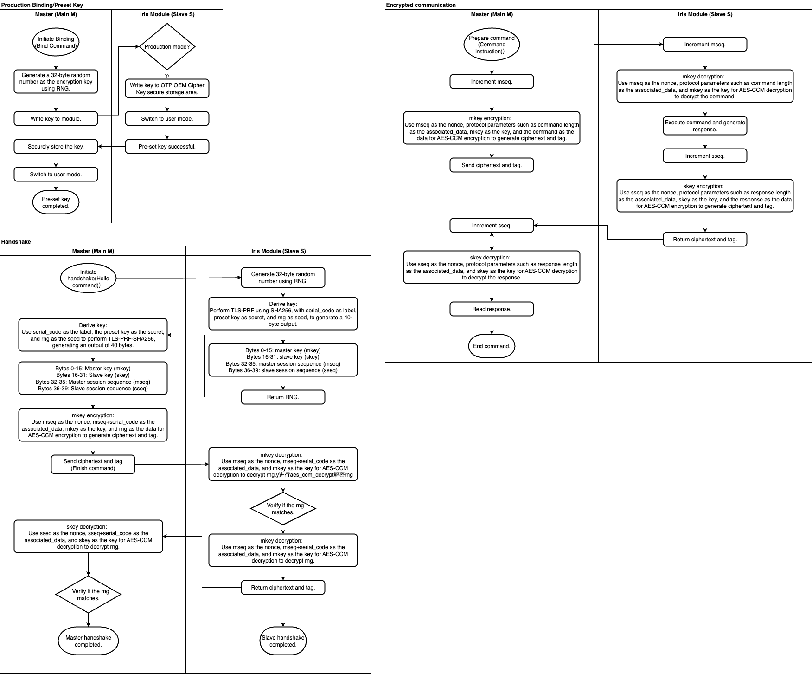
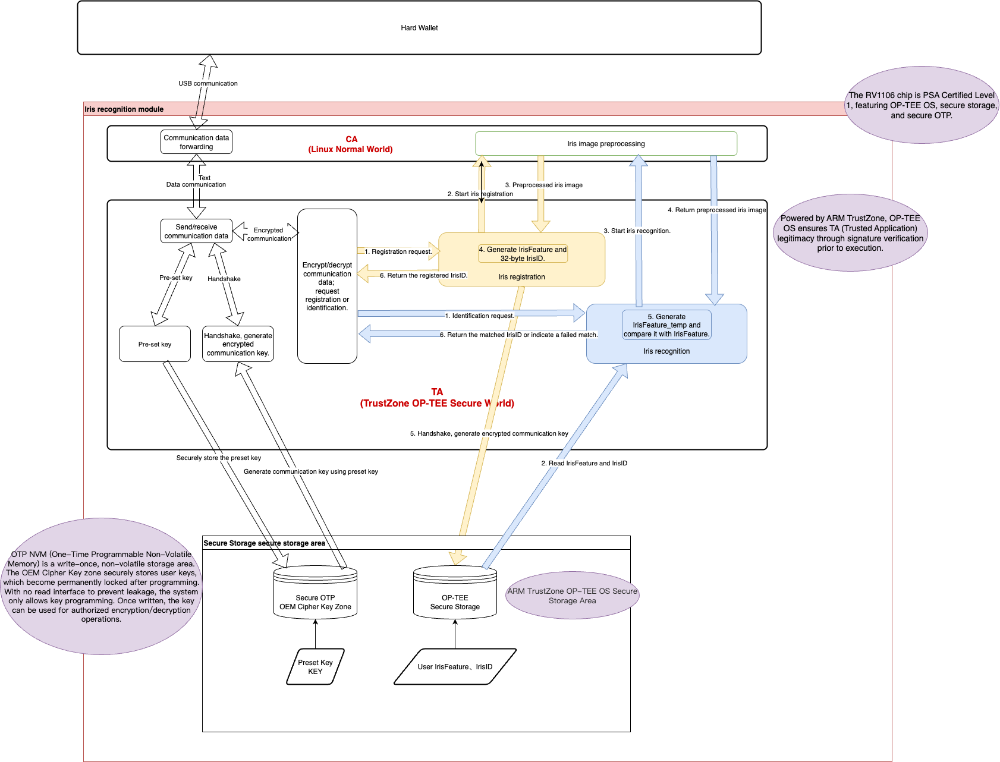

# Sealer2100 Open Source Outlook
[TOC]

## 🎯 Project Positioning
Sealer2100 is a hardware product designed for Web3 users. It ensures technical transparency while protecting core commercial value through reasonable licensing restrictions.


### Transparency Statement
Sealer2100 adopts a **restricted open-source model**. While protecting core intellectual property, it provides necessary code transparency for security auditing and oversight.  
This project follows the principles of **“auditable but not reusable”** and **“academic use only.”**

### Code Visibility
* All code is open source and inspectable.
* Algorithm implementations are fully transparent.
* Security mechanisms are comprehensively documented.

## 🔧 Architecture Design

### Iris Secure Communication Design



### Iris & Hardware Security Wallet Interaction Design

 

## 🛡️ Security Features
### Cryptography Implementation

- **Algorithm Support**: AES, ECC, RSA, SHA-2, SHA-3, and related standards
- **Key Management**: Hierarchical key architecture with hardware-backed protection
- **Random Number Generation**: True random number generator (TRNG), compliant with NIST standards
### System Security
* **Secure Startup**: Digital certificate–based full verification chain
* **Runtime Protection**: Memory isolation and code integrity checks
* **Anti-tampering Mechanism**: Protection at both physical and logical levels


## 📁 Project Structure
### Core Repository
```
sealer2100-project/
├── app/                         # Applications
│   └── design/                  # Design files
├── firmware/                    # Firmware source code
│   ├── ci/                      # Firmware CI/CD
│   ├── common/                  # Common implementations
│   ├── docs/                    # Firmware documentation
│   ├── core/                    # Core system firmware
│   ├── crypto/                  # Cryptography implementations
│   ├── tests/                   # Firmware tests
│   ├── tools/                   # Firmware build tools
│   └── storage/                 # Storage implementations
├── jub-sdk-cxx/                 # C++ SDK
│   ├── builds/                   # Build scripts
|   ├── include/                  # SDK header files
|   ├── common/                   # Common implementations
|   ├── img/                      # Image resources
|   ├── pbparse/                 # Protobuf implementation
│   ├── tests/                   # Firmware tests
│   ├── tools/                   # Firmware build tools
|   └── trezor-cryto/             # Cryptography implementation (Trezor)
|   ├── src/                      # SDK source code
│   └── cmake/                    # CMake configuration
├── jub-sdk-android/             # Android SDK
│   ├── app/                     #
│   │   ├── src/                 # SDK source code
│   │   └── libs/               # SDK libraries
│   └── gradle/                  # Project dependencies
└── compliance/                  # Compliance materials
    └── audit-reports           # Audit reports
```

## 🤝 Community Participation
### Contribution Guidelines
Security researchers and academic institutions are welcome to:
1. Report security vulnerabilities
2. Provide improvement suggestions
3. Participate in code reviews
4. Share research outcomes