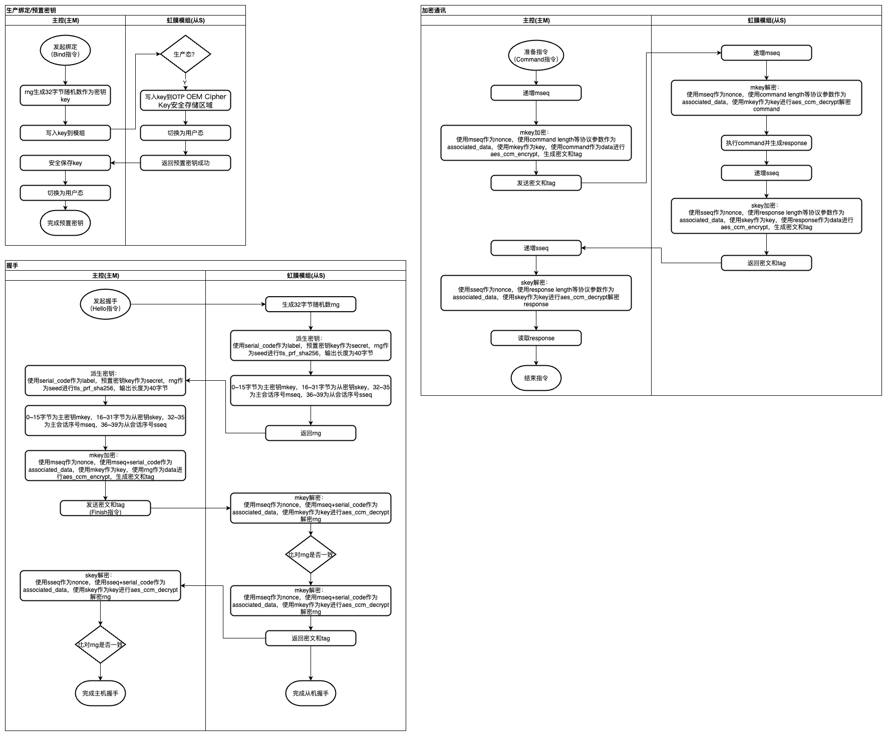
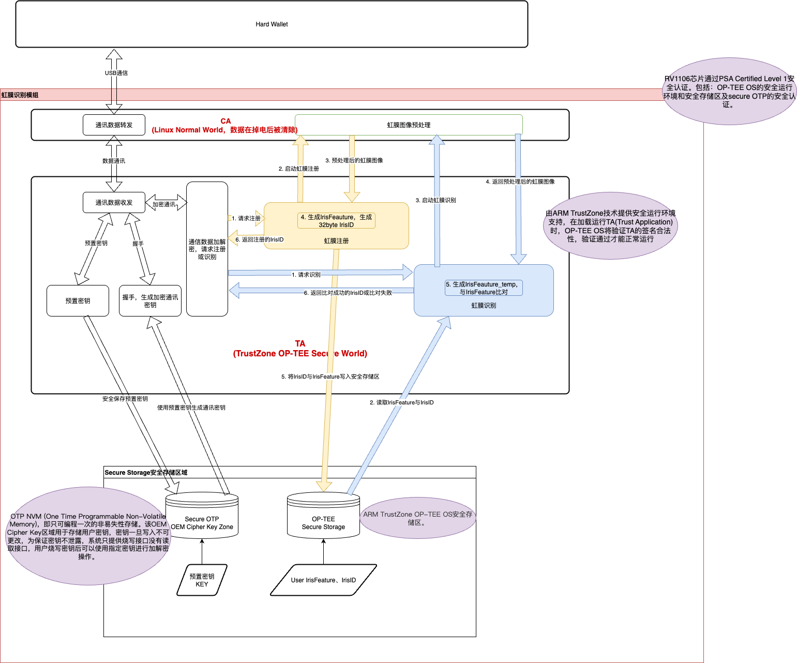

# Sealer2100 开源前瞻
[TOC]

## 🎯 项目定位
Sealer2100 是一款面向Web3用户的硬件产品。在保证技术透明度的同时，通过合理的许可限制保护核心商业价值。

### 透明性声明
Sealer2100 采用受限开源模型，在保护核心知识产权的同时，为安全审计和监督提供必要的代码透明度。本项目遵循「可审计但不可复用」、「仅限学术使用」的原则。
### 代码可见性
* 所有代码开源可查
* 算法实现完全透明
* 安全机制文档齐全

## 🔧 架构设计

### Iris 安全通信设计


### 虹膜与硬件安全交互设计
 

## 🛡️ 安全特性
### 密码学实现
* 算法支持: AES, ECC, RSA, SHA-2, SHA-3,etc.
* 密钥管理: 分层密钥体系，硬件保护
* 随机数生成: 真随机数源，符合NIST标准，安全可靠
### 系统安全
* 安全启动: 基于数字证书的完整验证链
* 运行时保护: 内存隔离，代码完整性检查
* 防篡改机制: 物理和逻辑层面的防护


## 📁 项目结构
### 核心仓库
```
sealer2100-project/
├── app/                         # 应用程序
│   └── design/                  # 设计文件
├── firmware/                    # 固件源代码
│   ├── ci/                      # 固件测试
│   ├── common/                  # 公共实现
│   ├── docs/                    # 固件文档
│   ├── core/                    # 核心系统固件
│   ├── crypto/                  # 密码学实现
│   ├── tests/                   # 固件测试
│   ├── tools/                   # 固件编译工具
│   └── storage/                 # 存储实现
├── jub-sdk-cxx/                 # C++ SDK
│   ├── builds/                   # 编译脚本
|   ├── include/                  # SDK头文件
|   ├── common/                   # 公共实现
|   ├── img/                      # 图片资源
|   ├── pbparse/                 # protobuf实现
│   ├── tests/                   # 固件测试
│   ├── tools/                   # 固件编译工具
|   └── trezor-cryto/             # 密码学实现
|   ├── src/                      # SDK源代码
│   └── cmake/                    # CMake配置
├── jub-sdk-android/             # Android SDK
│   ├── app/                     #
│   │   ├── src/                 # SDK源代码
│   │   └── libs/               # SDK库
│   └── gradle/                  # 项目依赖
└── compliance/                  # 合规性材料
    └── audit-reports           # 审计报告
```

## 🤝 社区参与
### 贡献指南
欢迎安全研究人员和学术机构：

1. 报告安全漏洞
2. 提供改进建议
3. 参与代码审查
4. 分享研究成果