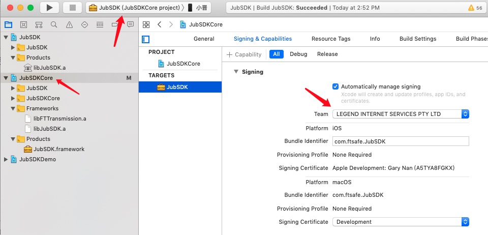
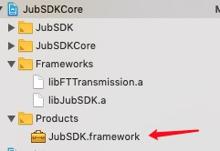

# Introduction
HyperPay SDK is a custom line derived from [JuBiter SDK](https://github.com/JubiterWallet/JubiterSDK_C.git). However, due to its early branching, there is a big difference in code architecture from the current JuBiter SDK.

# Supported Blockchains
JuBiter Core supports more than 20 blockchains: Bitcoin, Ethereum, and some major blockchain platforms.

| Index | Name | Symbol | URL |
| --- | --- | --- | --- |
| 0000 | Bitcoin | BTC | https://bitcoin.org |
| 0002 | Litecoin | LTC | https://litecoin.org |
| 0060 | Ethereum | ETH | https://ethereum.org |
| 0061 | Ethereum Classic | ETC |https://ethereumclassic.org |
| 0144 | XRP | XRP | https://ripple.com/xrp |
| 0145 | Bitcoin Cash | BCH |https://bitcoincash.org |
| 0171 | Hcash | HC | https://h.cash |
| 0194 | EOS | EOS | http://eos.io |
| 0195 | Tron | TRX | https://tron.network |
| 2301 | Qtum | QTUM | https://qtum.org |
| 0461 | Filecoin | FIL | https://filecoin.io |
| 0501 | Solana | SOL | https://solana.com |
| ---- | USDT | USDT | https://tether.to |

# API
JuBiter SDK supports software & hardware implementation for JuBiter wallet. Hardware support mainly JuBiter series products, including JuBiter Blade, JuBiter Bio and JuBiter Lite.

Accordingly, JuBiter SDK is divided into the following modules, common module, device operation related module, Blade related module, Bio related module, Lite related module, coin related module, and software wallet module, etc.

There are two IDs in JuBiter SDK, deviceID and contextID. The first one is used to operate and connect hardware devices, and the last one is used for device-related and coin-related operations in a coin context. So, deviceID is obtained through the device operation related interface, and contextID is obtained through the coin-related interface.

### API include:
- Device in HID mode related module (see [here](include/JUB_SDK_DEV_HID.h))
- Device in BLE mode related module (see [here](include/JUB_SDK_DEV_BLE.h))
- Device in BIO mode related module (see [here](include/JUB_SDK_DEV_BIO.h))
- Device operation related module (see [here](include/JUB_SDK_DEV.h))
- Coin related module (see [BTC](include/JUB_SDK_BTC.h), [ETH](include/JUB_SDK_ETH.h), [Hcash](include/JUB_SDK_Hcash.h), [EOS](include/JUB_SDK_EOS.h), [XRP](include/JUB_SDK_XRP.h), [TRX](include/JUB_SDK_TRX.h), [FIL](include/JUB_SDK_FIL.h))

# Dependency
| Name | URL | Note |
| ---- | ---- | ---- |
| **Trust Wallet Core** | https://github.com/trustwallet/wallet-core.git | Source level integration, based on v2.2.10. The code added by JuBiter is identified as "JuBiter-defined". |
| **JSON for Modern C++** | https://github.com/nlohmann/json.git | Source level integeration, based on v3.9.1. |
| **C++ Big Integer Library** | https://mattmccutchen.net/bigint | Source level integeration, based on 'bigint-2010.04.30.tar.bz2. |
| **protobuf in C++**  | https://developers.google.com/protocol-buffers | Google Protocol Buffers. Library level integeration, based on [v3.9.1](https://github.com/protocolbuffers/protobuf/releases/tag/v3.9.1). |
| **uint256_t** | https://github.com/calccrypto/uint256_t.git | Source level integeration, based on master. |
| ios-cmake | https://github.com/leetal/ios-cmake.git | For compiler. |
|  |  |  |
| **Bluetooth communication library** for HyperMate hpy/hpy2 & mw/mw2 | --- | JuBiter developed. |


## iOS 打包配置
准备依赖库。
```bash
git submodule update --init --recursive
```
如果上述操作过程因网络原因不顺利，则可分以下步骤逐个完成依赖库的下载工作。
克隆本项目后，终端进入根目录，执行以下命令：
```
> cd deps
> git clone https://github.com/nlohmann/json.git
> git clone https://github.com/protocolbuffers/protobuf.git
> git clone https://github.com/leetal/ios-cmake.git
```


安装 **cmake**:
`brew install cmake`

安装 **hidapi**:
`brew install hidapi`

切换到 **HardWalletSDK** 根目录，执行 `mkdir build & cd build & cmake ..`

---

打开 Xcode 项目，如下图所示：


按下图所示，选好公司证书：

然后在真机和模拟器上各编译一次，
`Show in Finder` 打开编译好的 **JubSDK.framework** 目录。


 打包时注意，真机编译需要使用arm64，模拟器使用x86_64

然后在桌面上新建个文件夹命名 **HDWalletSDK**，分别将上面真机和模拟器编译的 **Release-iphoneos** 和 **Release-iphonesimulator** 文件夹拷贝放入 **HDWalletSDK** 目录下；然后执行以下合并命令：

```
lipo -create Release-iphoneos/JubSDK.framework/JubSDK Release-iphonesimulator/JubSDK.framework/JubSDK -output JubSDK
```
若无意外，此时在  **JubSDK** 文件夹下便会生成 合并后的 **JubSDK**，格式是 `exec 可执行文件` 。
将此文件拷贝到此目录下 **Release-iphoneos/JubSDK.framework/JubSDK** ，点击替换。

然后返回上一级目录将 **JubSDK.framework** 拷贝到项目中并替换。

>确保在项目 Target - General - Libraries 里的 JubSDK.framework 是 Embed & Sign 选项。

# Compiler Installation
编译工程文件已经迁移到CMake
1.安装 CMake 3+
2.Mac 和 Linux 需要安装 hidapi
2.mkdir build & cd build & cmake ..
3.make

### libJubSDK.a & libprotobuf.a for iOS compiling: ###
The outputs are in the "$(SRCROOT)/../../outputs" catalogue.
```bash
> mkdir build
> cd build
> cmake .. -G Xcode -DCMAKE_TOOLCHAIN_FILE=../deps/ios-cmake/ios.toolchain.cmake -DENABLE_BITCODE=1 -DPLATFORM=OS64
> cmake --build . --config Release --target
```
or simply proceed
```bash
> sh ./tools/ios-build
```

### JubSDK.framework for iOS compiling:
```bash
> mkdir build
> cd build
> cmake ../JubSDKCore -G Xcode -DCMAKE_TOOLCHAIN_FILE=../deps/ios-cmake/ios.toolchain.cmake  -DENABLE_BITCODE=1 -DPLATFORM=OS64COMBINED
> cmake --build . --config Release --target
```

> ### Special Note for cmake compiling
> Cmake is not finished yet, need to manually adjust the builds/ios/JubSDKCore xcodeproj project.
> The dependencies are libFTTransmission.a, libJubSDK.a and libprotobuf.a, where libFTTransmission.a is in "$(SRCROOT)/../../outputs/bleTransmit/...", libJubSDK.a and libprotobuf.a are in "$(SRCROOT)/../../outputs/...".
> 1. Add linked binary into the framework: "TARGETS" -> "Build Phases" -> "Link Binary With Libraries"
> 2. Check if the dependencies are included: "TARGETS" -> "General" -> "Frameworks and Libraries"
> 3. Set framework search path: "TARGETS" -> "Build Settings" -> "Search Paths" -> "Framework Search Paths".
>
> The following steps are ignored...
> 1. XCODE_ATTRIBUTE_DEVELOPMENT_TEAM (in cmake/ios.toolchain.cmake), line336
>     eg. set(CMAKE_XCODE_ATTRIBUTE_DEVELOPMENT_TEAM xxx CACHE INTERNAL "")
> 2. framework attributes (in JubSDKCore/CMakeLists.txt), line16 ~ line33.

# Demo reference
+ [HyperPaySDKDemo-iOS](https://github.com/FT-JubiterWallet/HyperPaySDKDemo-iOS.git)
